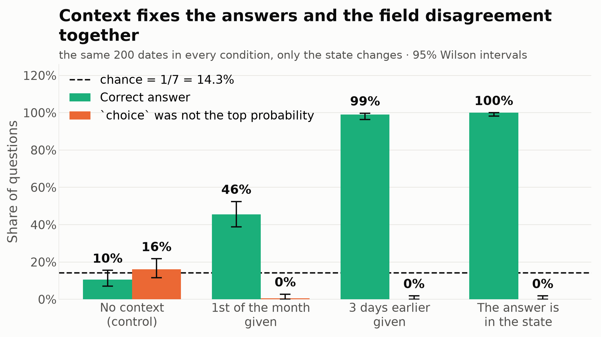

# Does context help Jev, and does it fix the `choice` disagreement?

The same 200 dates asked four ways. The question text and the options are identical throughout; only `state` changes. Ground truth never appears except in the `lookup` condition, where it is deliberately placed among 39 distractor rows.

| State contains | Accuracy | 95% CI | `choice` mismatch | 95% CI | Mean top probability | Tie rate |
|---|---|---|---|---|---|---|
| nothing (control) | 10.5% | 6.97%-15.52% | 16.0% | 11.57%-21.71% | 0.144 | 47% |
| the 1st of that month | 45.5% | 38.75%-52.42% | 0.5% | 0.09%-2.78% | 0.633 | 1% |
| the date 3 days earlier | 99.0% | 96.43%-99.73% | 0.0% | 0.00%-1.88% | 0.968 | 0% |
| **the answer itself** | 100.0% | 98.12%-100.00% | 0.0% | 0.00%-1.88% | 1.000 | 0% |

Lookup against control on accuracy: Fisher's exact, two-sided p = 2.43e-90.
Lookup against control on the mismatch rate: p = 1.21e-10.

**One caveat on `month_anchor`.** When the date asked about is itself the 1st, the anchor *is* the answer, so those questions measure lookup rather than counting. That affects 8 of 200 dates and the model got all 8 right. Excluding them, accuracy in that condition is 83/192 = 43.2% rather than the 45.5% in the table. Every other condition is clean: the `near_anchor` reference is always three days before the date asked about and can never coincide with it.

*Accuracy and the `choice` mismatch rate across the four conditions.*

## How far can it count?

In `month_anchor` the model is told the weekday of the 1st and must count forward. Accuracy collapses with the distance it has to cover. Dates that are themselves the 1st are excluded here, since for those the anchor is the answer.

| Day of the month | Correct | Rate |
|---|---|---|
| 2-7 | 36 / 43 | 83.7% |
| 8-14 | 28 / 39 | 71.8% |
| 15-21 | 17 / 57 | 29.8% |
| 22-31 | 2 / 53 | 3.8% |

Its mistakes are not random guesses. The signed offset of the chosen weekday from the correct one, over the 109 wrong answers in that condition:

| Offset in days | -3 | -2 | -1 | +1 | +2 |
|---|---|---|---|---|---|
| Count | 11 | 20 | 6 | 71 | 1 |

The most common single error is +1 day (71 of 109), the signature of an off-by-one in the count rather than a wrong method.

In `near_anchor` only 2 of 200 were wrong, and every one of them crosses a month boundary: 2042-03-01 (told the weekday of 2042-02-26), answered Sunday for Saturday; 2087-03-02 (told the weekday of 2087-02-27), answered Monday for Sunday.

## The probabilities only mean something once the model knows something

| State contains | Mean top probability when right | When wrong |
|---|---|---|
| nothing (control) | 0.140 | 0.144 |
| the 1st of that month | 0.828 | 0.470 |
| the date 3 days earlier | 0.972 | 0.595 |
| **the answer itself** | 1.000 | n/a |

Without context the top probability is 0.14 whether the answer is right or wrong, so it carries no signal at all. With context it separates cleanly, which is the behaviour the product promises.

## Two things this confirms about the main result

1. **The mismatch replicates.** The control condition here is a fresh set of 200 requests and reproduces the headline rate: 16.0% against 16.3% in the original 1,000.
2. **The prediction in the report holds.** It said mismatches should become rarer once gaps widen. They disappear entirely: 16.0% with no context, 0.5% once an anchor is given, and 0% in both conditions where the model is confident. The disagreement is real but it only bites in photo finishes, which is where a near-uniform distribution puts you.
