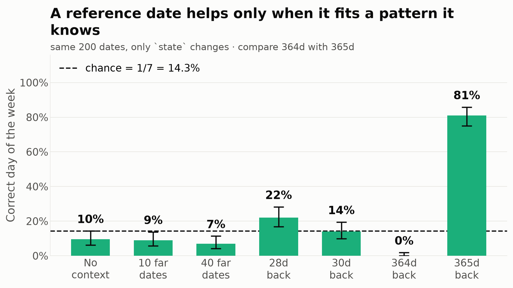

# Can Jev use reference dates it cannot simply count from?

The first probe gave anchors 3 days or 1 month away, which is close enough to count on your fingers. This one removes that. The same 200 dates are asked again with reference material that is either far away or deliberately structured to tell copying apart from computing. Only `state` changes.

| State contains | Accuracy | 95% CI | Answered the reference date's own weekday |
|---|---|---|---|
| nothing (control) | 9.5% | 6.17%-14.36% | n/a |
| 10 true date/weekday pairs, every one at least 60 days away | 9.0% | 5.77%-13.78% | n/a |
| 40 true date/weekday pairs, every one at least 60 days away | 7.0% | 4.22%-11.41% | n/a |
| one pair, 28 days back (**4 whole weeks**, so the answer *is* that weekday) | 22.0% | 16.82%-28.24% | 22.0% |
| one pair, 30 days back (not a week multiple, the answer is 2 days later) | 14.0% | 9.87%-19.49% | 35.5% |
| one pair, 364 days back (**52 whole weeks**, so the answer *is* that weekday) | 0.0% | 0.00%-1.88% | 0.0% |
| one pair, 365 days back (not a week multiple, the answer is 1 day later) | 81.0% | 75.00%-85.83% | 0.0% |

`scatter_10` against the control: Fisher's exact, two-sided p = 1.
`scatter_40` against the control: Fisher's exact, two-sided p = 0.468.

*Accuracy when the reference material cannot be counted from, and how often the answer is simply the reference date's own weekday.*

## Scattered references do not help at all

Ten true date/weekday pairs scored 9.0% and forty scored 7.0%, against 9.5% for no context. Everything needed is present, since any known date plus arithmetic yields any other, and four times as much of it changes nothing. What the earlier probe measured was not use of reference material. It was counting on your fingers from a nearby date.

## One day changes 81% into 0%

The sharpest result here is the pair at the end. A single reference date 365 days back scores 81.0%. Move that same reference one day, to 364 days back, and it scores 0.0%: not one correct answer in 200. By the day count 364 is the easier of the two, being exactly 52 weeks, so the answer is simply the reference date's own weekday.

| Date asked | Truth | 365 days back | Its weekday | Answer | 364 days back | Answer |
|---|---|---|---|---|---|---|
| 2027-03-21 | **Sunday** | 2026-03-21 | Saturday | Sunday | 2026-03-22 | Saturday |
| 2027-06-08 | **Tuesday** | 2026-06-08 | Monday | Tuesday | 2026-06-09 | Monday |
| 2027-10-07 | **Thursday** | 2026-10-07 | Wednesday | Thursday | 2026-10-08 | Friday |
| 2028-03-29 | **Wednesday** | 2027-03-30 | Tuesday | Thursday | 2027-03-31 | Friday |

The mechanism is visible once the 365-day condition is split by whether that reference really lands on the same calendar date. Without a leap day in between it does, and accuracy is 155/158 = 98.1%. With a leap day in between, 365 days lands a day off the matching date, and accuracy falls to 7/42 = 16.7%, near chance.

So it is not counting 365 days. It recognises *the same calendar date one year earlier* and applies the rule that this advances the weekday by one. Give it a reference that does not fit that shape and the rule misfires. At 364 days it answers exactly one day before the correct day in 78.5% of cases, which is a systematic error, not noise.

## It is confidently wrong, which is worse than being uncertain

| State contains | Accuracy | Mean top probability | Mean `confidence` |
|---|---|---|---|
| nothing (control) | 9.5% | 0.143 | 0.018 |
| 10 true date/weekday pairs, every one at least 60 days away | 9.0% | 0.206 | 0.093 |
| 40 true date/weekday pairs, every one at least 60 days away | 7.0% | 0.202 | 0.087 |
| one pair, 28 days back (**4 whole weeks**, so the answer *is* that weekday) | 22.0% | 0.272 | 0.169 |
| one pair, 30 days back (not a week multiple, the answer is 2 days later) | 14.0% | 0.304 | 0.204 |
| one pair, 364 days back (**52 whole weeks**, so the answer *is* that weekday) | 0.0% | 0.507 | 0.437 |
| one pair, 365 days back (not a week multiple, the answer is 1 day later) | 81.0% | 0.669 | 0.621 |

With no context the model is at chance and says so, reporting a top probability of 0.14 across eight options. With a 364-day reference it is wrong on every single question while reporting 0.51 and a confidence of 0.44. Adding context that looks helpful but is not removes the one useful signal the earlier probe found, which was that low confidence meant the model did not know.
