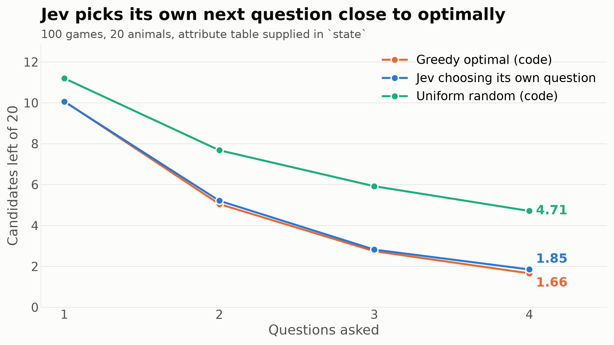

# Can Jev choose its own next question?

Every chain elsewhere in this repo had Python deciding what to ask. This inverts that: 100 games of twenty questions over 20 animals, where the only thing Jev does is pick which of ten questions to ask next. The attribute table for the remaining candidates is supplied in `state`, so no world knowledge is needed; code answers truthfully and filters the list, so no arithmetic is asked of the model. Questions already asked stay in the pool, because re-picking one is the cheapest planning failure to detect.

Two scores per turn. **Efficiency** is the information the chosen question actually yields divided by the most any question could have yielded, which is the fair measure: a question worth 0.92 bits against a best of 0.99 is not a planning failure. **Wasted** counts picks that eliminate nothing, and only over games where something useful was still on the table.

| Turn | Efficiency | Wasted picks | Exact match to the best question | Bits gained | Best available | Random would get |
|---|---|---|---|---|---|---|
| 1 | **100.0%** | 0 / 100 | 100 / 100 (100%) | 0.993 | 0.993 | 0.926 |
| 2 | **94.0%** | 0 / 100 | 0 / 100 (0%) | 0.933 | 0.993 | 0.557 |
| 3 | **96.5%** | 0 / 100 | 72 / 100 (72%) | 0.946 | 0.980 | 0.307 |
| 4 | **100.0%** | 0 / 59 | 91 / 91 (100%) | 0.617 | 0.617 | 0.151 |

**It never asked a pointless question.** Across all 359 turns where a discriminating question was still available, it picked one that eliminates nothing 0 times. Already-asked questions were left in the pool the whole time.

The exact-match column is the strict reading and undersells it. At turn 2 it matched the argmax in 0 of 100 games while still capturing 94% of the available information, because it consistently took a question worth 0.918 bits when the best was 0.991.

## End to end

After 4 questions, the average number of candidates still standing out of 20. Each policy plays its own 100 games against the same hidden targets.

| Policy | Candidates left | Games narrowed to exactly one |
|---|---|---|
| Greedy optimal, chosen in code | 1.66 | 34% |
| **Jev choosing its own question** | **1.85** | **27%** |
| Uniform random, chosen in code | 4.71 | 3% |

Jev closes 94% of the distance between random and optimal play.

*Candidates remaining after each question, for the three policies.*

## What this changes

Elsewhere in this repo the plan always lived in Python and Jev filled in blanks, which made every chain a program with model-shaped function calls rather than anything that composed its own reasoning. This is the opposite arrangement and it holds up: given the state of a search and a menu of moves, the model selects near-optimally and never wastes a turn.

Two limits worth stating. The menu of questions was supplied, so this is selection among given options and not generation of new ones. And the horizon is one step: the greedy baseline it matches is itself myopic, so nothing here shows lookahead over several moves.
