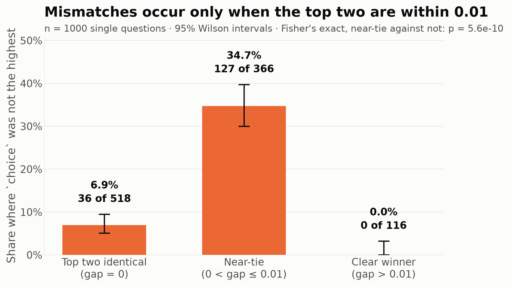
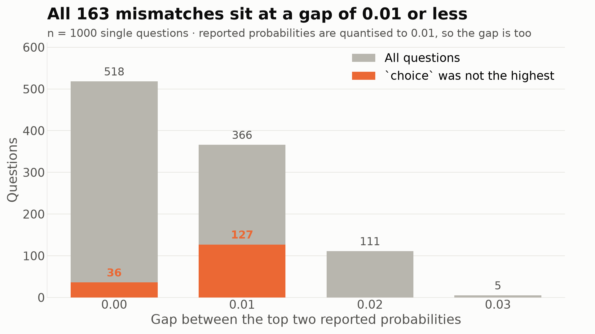
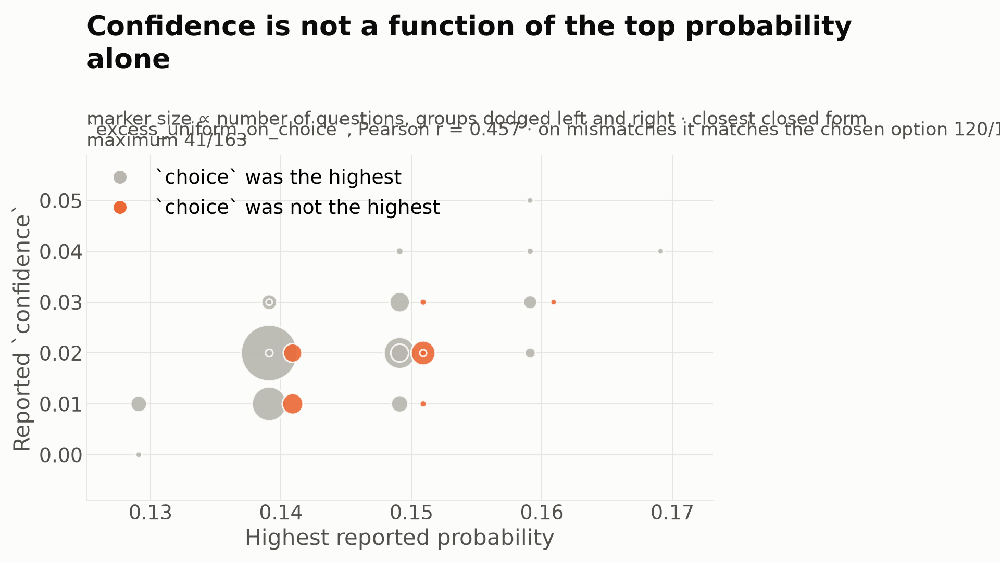
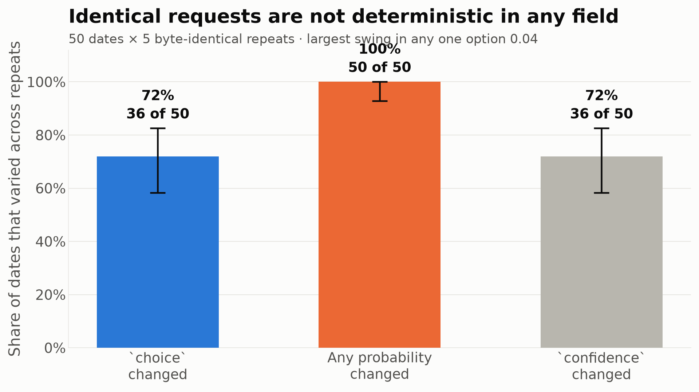
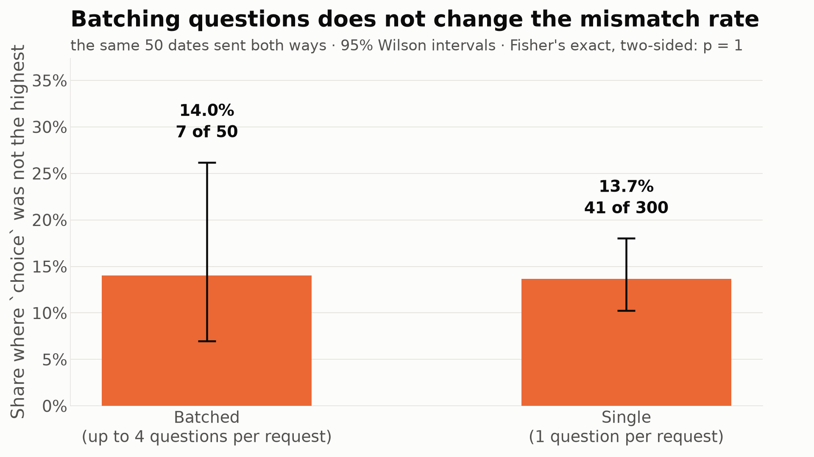
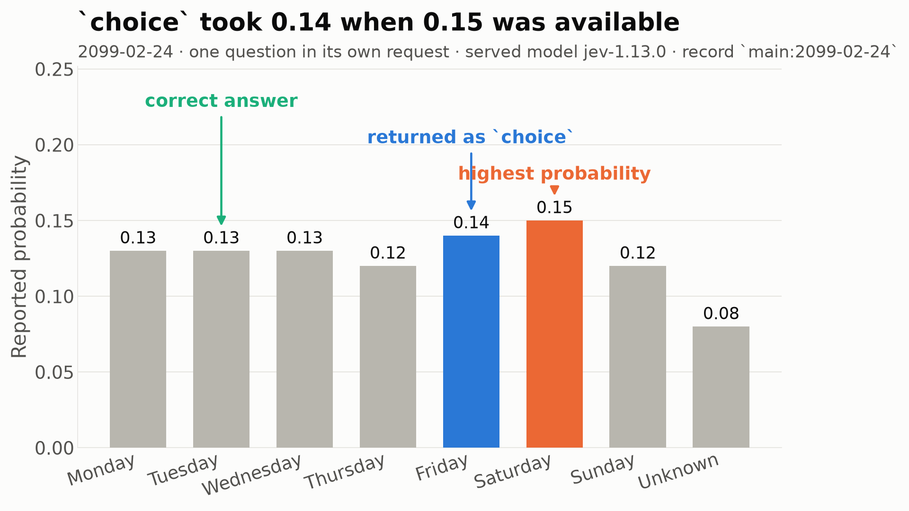

# Jev `Choice`: `choice` does not always match the highest returned probability

In **16.30%** of 1000 single-question requests (95% CI 14.14%-18.72%), the `choice` field named an option whose entry in the same response's `probabilities` map was lower than the maximum, which contradicts the API's documented contract that `choice` is "the name of the choice with the highest probability among the question's criteria".

## Method

- **Model requested** `jev-latest`. **Served on every response** `jev-1.13.0` (1300 answers).
- **Endpoint** `POST https://api.typesafe.ai/v1/systemone`, schema taken from the published OpenAPI document at `https://api.typesafe.ai/openapi.json`.
- **Seed** 20260919. Dates are sampled uniformly without replacement from 2027-01-01 to 2099-12-31.
- **Samples** 1000 unique dates, one question per request; 50 of those dates re-sent 5 times each as byte-identical requests; and the same 50 dates sent again in batches of up to 4 questions per request. 1300 questions in total.
- **State**, identical on every request: `Hello.`
- **Question**: `What day of the week is {date} in the Gregorian calendar?`
- **Options**, fixed order: `Monday`, `Tuesday`, `Wednesday`, `Thursday`, `Friday`, `Saturday`, `Sunday`, `Unknown`
- **Ground truth** comes from Python's `datetime` and is never part of any request.
- **Tolerance** 1e-09. A mismatch is `probabilities[choice] < max(probabilities)` by more than that tolerance.

Two properties of the response format matter for reading everything below:

- Reported probabilities are **quantised to 0.01**: all 10400 values sit within 2.8e-17 of a multiple of 0.01, spanning 13 distinct values from 0.05 to 0.17. The granularity is in the numbers themselves, not only in their display: the response body carries full float64 text, and 3.6% of values are an ULP off the grid (`0.13999999999999999` rather than `0.14`), so the vector is the result of arithmetic that lands on a 0.01 grid rather than a literal rounding applied for display.
- Vectors are not renormalised after quantisation: sums range from 0.99 to 1.00.
- `choice` was always one of the supplied criteria: True.

## Results

| Measure | Count | Rate | 95% Wilson CI | Test |
|---|---|---|---|---|
| Mismatch, single questions | 163 / 1000 | 16.30% | 14.14%-18.72% | primary result |
| Mismatch, gap = 0 (top two identical) | 36 / 518 | 6.95% | 5.06%-9.47% |  |
| Mismatch, 0 < gap ≤ 0.01 | 127 / 366 | 34.70% | 30.00%-39.71% |  |
| Mismatch, gap > 0.01 | 0 / 116 | 0.00% | 0.00%-3.21% |  |
| Mismatch deficit greater than one 0.01 step | 0 / 1000 | 0.00% | 0.00%-0.38% | bounds the disagreement |
| Ties at the maximum (more than one option) | 518 / 1000 | 51.80% | 48.70%-54.88% |  |
| `choice` correct | 147 / 1000 | 14.70% | 12.64%-17.03% | binomial vs 1/7: p = 0.7177 |
| argmax correct (ties broken at random) | 132 / 1000 | 13.20% | 11.24%-15.44% | binomial vs 1/7: p = 0.3428 |
| `choice` changed across identical repeats | 36 / 50 | 72.00% | 58.33%-82.53% | 50 dates |
| Any probability changed across identical repeats | 50 / 50 | 100.00% | 92.87%-100.00% | 50 dates |
| `confidence` changed across identical repeats | 36 / 50 | 72.00% | 58.33%-82.53% | 50 dates |
| Mismatch, batched requests | 7 / 50 | 14.00% | 6.95%-26.19% | Fisher vs single: p = 1.0000 |
| Mismatch, single requests, same dates | 41 / 300 | 13.67% | 10.24%-18.02% |  |

**Near-tie association.** Of 884 questions whose top two probabilities differ by at most 0.01, 163 mismatched. Of 116 questions with a larger gap, 0 mismatched. Fisher's exact test, two-sided: odds ratio inf, p = 5.59e-10.

**Size of the disagreement.** Every mismatch was short of the maximum by exactly 0.01 (counts: {"0.01": 163}). The largest deficit observed was 0.01, one step of the reporting grid.

**`Unknown`.** Mean probability 0.0866, range 0.05 to 0.16, median 0.09. It held the maximum in 1.0% of questions and was returned as `choice` in 0.4%.




*Mismatch rate by the gap between the top two reported probabilities, with 95% Wilson intervals.*




*Distribution of the top-1 minus top-2 gap, with the mismatching questions overlaid.*


*Accuracy of `choice` against the accuracy of taking the highest probability, both against a 1/7 chance line.*

### How `confidence` relates to the probabilities

Confidence ranged from 0.00 to 0.05 (mean 0.0186). Candidate closed forms, evaluated against the reported value:

| Candidate | Pearson r | Spearman ρ | Equal after rounding to 2dp | Mean abs. difference |
|---|---|---|---|---|
| `excess_uniform_on_choice` | 0.4567 | 0.2913 | 57.6% | 0.0059 |
| `excess_uniform_on_max` | 0.4453 | 0.3411 | 49.7% | 0.0060 |
| `margin_top1_top2` | 0.0182 | -0.0618 | 18.5% | 0.0131 |
| `one_minus_norm_entropy` | 0.6161 | 0.6240 | 2.0% | 0.0133 |
| `p_max` | 0.4453 | 0.3411 | 0.0% | 0.1249 |
| `p_choice` | 0.4567 | 0.2913 | 0.0% | 0.1232 |
| `gini` | 0.6421 | 0.6259 | 0.0% | 0.1089 |

Restricting to the 163 mismatching questions, the closed form `(p - 1/k) / (1 - 1/k)` rounded to two decimals reproduces the reported confidence for **120** of them when `p` is the probability of the *chosen* option, against **41** when `p` is the *maximum* probability.




*Reported confidence against the highest reported probability, with mismatches highlighted.*

### Determinism

Each of 50 dates was sent 5 times as a byte-identical request. `choice` varied on 36 of them (72.00%); the probability vector varied on 50 (100.00%). The largest swing in any single option's probability across repeats was 0.04, with a mean of 0.0098.




*Share of dates where the field changed across five identical repeats.*

### Batched against single requests

Batch sizes sent: {"4": 48, "2": 2}. The mismatch rate was 14.00% batched against 13.67% single on the same dates (Fisher's exact, two-sided: p = 1.0000).




*Mismatch rate for batched against single-question requests on the same dates.*

## Conclusion

**The data supports the hypothesis that `choice` and `probabilities` are not produced by the same computation.** Three observations carry that conclusion.

1. The disagreement is real and frequent: 16.30% of single questions, 14.14%-18.72% at 95%.
2. It cannot be an artefact of rounding one vector for display. Rounding to a grid is monotone: if one raw probability is at least another, its rounded value is at least the other's rounded value. So if `choice` were the argmax of the same vector that was then rounded into `probabilities`, `probabilities[choice]` would still be a maximum of the rounded vector, and the mismatch rate would be zero. It is not.
3. The disagreement is bounded at exactly one reporting step. Every one of the 163 mismatches fell short of the maximum by 0.01 and none by more (0 of 1000 exceeded one step), and all of them occurred where the top two probabilities were within 0.01 (Fisher's exact p = 5.59e-10). The two computations therefore agree closely, disagreeing only where a difference smaller than the reporting resolution decides the ordering.

The repeat experiment shows the endpoint is not deterministic in any field: across 5 byte-identical repeats the probability vector changed on 100.00% of dates and `choice` changed on 72.00%. That rules out a stale or cached component as the source of the mismatch, since no field is fixed between calls, but it does not by itself separate the two computations: the mismatch above is a disagreement *inside a single response*, which repetition across calls cannot explain either way.

`confidence` sides with `choice` rather than with the reported maximum on mismatching questions (120 against 41 of 163), which is consistent with `choice` and `confidence` being read off one internal vector and `probabilities` being reported from another, or from the same one at lower precision.

What the data does not establish: which of the two is correct, whether the cause is precision, a separate pass, or an ordering step, and whether the behaviour extends to tasks where the model is not at chance. On this task neither rule beat chance (`choice` 14.70%, p = 0.7177; argmax 13.20%, p = 0.3428), which is what makes near-ties common enough to expose the disagreement at all. A task the model can do would produce larger gaps and, on this evidence, fewer mismatches.

## Minimal reproduction

Record `main:2099-02-24`. `choice` is `Friday` at 0.14, while `Saturday` is reported at 0.15 in the same response.

Request:

```json
{
  "model": "jev-latest",
  "questions": {
    "q0": {
      "criteria": {
        "Friday": null,
        "Monday": null,
        "Saturday": null,
        "Sunday": null,
        "Thursday": null,
        "Tuesday": null,
        "Unknown": null,
        "Wednesday": null
      },
      "instructions": "What day of the week is 2099-02-24 in the Gregorian calendar?",
      "type": "choice"
    }
  },
  "state": "Hello."
}
```

Response:

```json
{
  "answers": {
    "q0": {
      "choice": "Friday",
      "confidence": 0.02,
      "probabilities": {
        "Friday": 0.14,
        "Monday": 0.13,
        "Saturday": 0.15000000000000002,
        "Sunday": 0.12,
        "Thursday": 0.12,
        "Tuesday": 0.13,
        "Unknown": 0.08,
        "Wednesday": 0.13
      },
      "type": "choice"
    }
  },
  "model": "jev-1.13.0",
  "usage": {
    "input_tokens": 343,
    "output_tokens": 74
  }
}
```




*The full probability vector for the reproduction above.*


## Files

- `raw_responses.jsonl`: every request and response, one JSON object per line, 1300 questions across 1263 requests.
- `per_question_results.csv`: one row per question with the derived columns used above.
- `results.json`: every statistic in this report, as computed.
- `charts/`: the figures, regenerated from the JSONL by `python -m choice_audit.analyze`.

Collection and analysis are separate programs. The analysis makes no network calls, so every number here can be recomputed from the committed JSONL alone.
