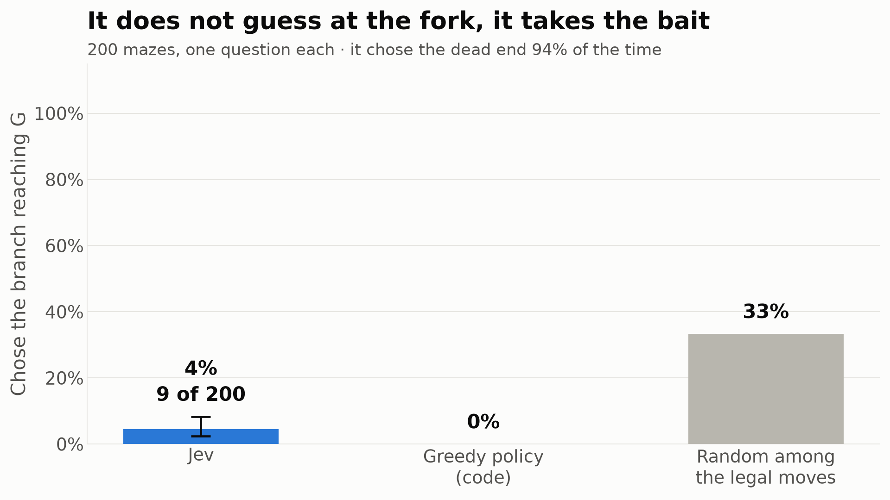
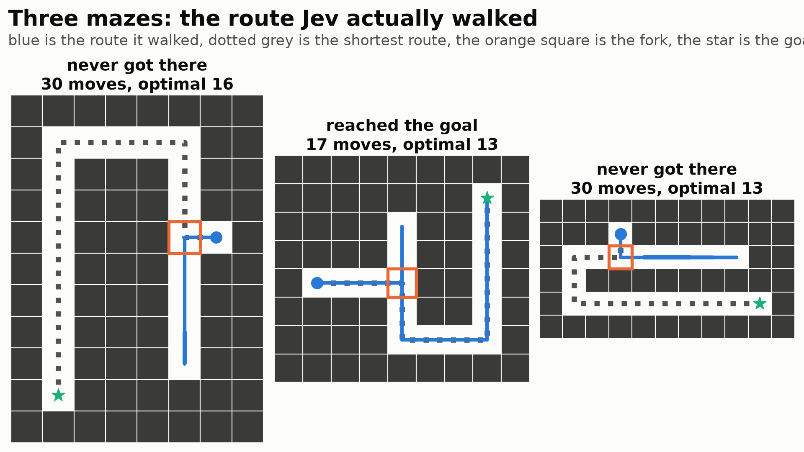

# Does Jev look further than one move ahead?

The planner experiment in the sibling folder showed Jev choosing its next question near-optimally, but the baseline it matched was *greedy*, so nothing there ruled out a purely myopic policy. These mazes are built so that greedy is provably wrong.

Every maze has one fork. One branch points straight at the goal and dead-ends a few cells later; the other starts by moving away from the goal and is the only route there. A policy that minimises distance-to-goal takes the bait every time and never arrives.

```
########
#.....##
#.###.##
#.###.##
#.###@.#
#.###.##
#.###.##
#.###.##
#.###.##
#G######
########
```

The agent is at `@`, the goal at `G`. East leads two cells and stops. West, then north, then east along the top is the only way, and its first step increases the distance to the goal. Walls are given explicitly in the state as `blocked_by_wall`, so reading the picture is not the thing being tested.

## The fork, asked once per maze

| Policy | Chose the branch that reaches the goal | 95% CI |
|---|---|---|
| **Jev** | **9 / 200 = 4.5%** | 2.4%-8.3% |
| Greedy, in code | 0% by construction | |
| Random among the legal moves | 33.3% | |

Every fork has exactly 3 legal moves, so chance is 33.3%. At 4.5% it is not guessing. It chose the dead end in 188 of 200 cases (94.0%), which is a greedy policy with almost no noise.

It never once moved into a wall, in 200 fork decisions and 803 decisions overall. Legality was given in the state as a `blocked_by_wall` flag and it used it perfectly. The failure is not carelessness.

It was also more confident when it was wrong: mean top probability 0.674 on the bait against 0.492 on the correct branch.



*The fork decision against the two code-side baselines.*

## Does a record of the dead end help?

The second phase lets it navigate from the start, one request per step, capped at 30 steps, on 30 of the same mazes. This time the state carries the trail: which cells it has already stood on, and an `already_visited` flag on each move. A dead end it has walked into is therefore visible in the state, and looping becomes a choice rather than an inevitability.

| At the fork | Correct | Rate |
|---|---|---|
| First visit, dead end not yet explored | 2 / 30 | 6.7% |
| Later visits, dead end already in the trail | 9 / 28 | 32.1% |
| Random among the legal moves | | 33.3% |

This is the most interesting number here, and it is smaller than it first looks. Having walked the dead end takes it from 6.7% to 32.1%, roughly a fivefold improvement, but 32.1% is indistinguishable from the 33.3% you get by picking at random among the legal moves. The memory does not teach it the route. It cancels the pull of the bait and leaves it guessing.

Over a whole maze that is still worth something:

| | Value |
|---|---|
| Reached the goal | 8 / 30 = 26.7% |
| Greedy policy, in code | 0% |
| Steps taken when it arrived | 17.9 |
| Shortest possible | 14.9 |
| Moves into a wall | 0 of 803 |



*Three mazes with the route it walked against the shortest route.*

## What this settles

The planner experiment in the sibling folder left an open question: it matched a greedy baseline, so was it planning or just being greedy? This answers it. **Just greedy.** Where greedy and correct come apart, it follows greedy off a cliff, at a rate well below chance.

That reframes the planner result rather than overturning it. In twenty questions the greedy move usually *is* the good move, so a myopic policy looks like a planner. The skill on display there was judging one step well, which it does; the lookahead was never being tested.

Two things it does do well. It obeys stated constraints exactly, never entering a wall in 803 decisions. And it reacts to state you put in front of it: an explicit record of failure is enough to break the loop, even though it cannot derive the same conclusion by looking ahead.

The practical reading is the same one the chain experiment reached from the other side. Hold the plan in code, hold the memory in code, and use the model for the one-step judgment. Here a four-line breadth-first search does the whole task perfectly, and no amount of asking helps.
